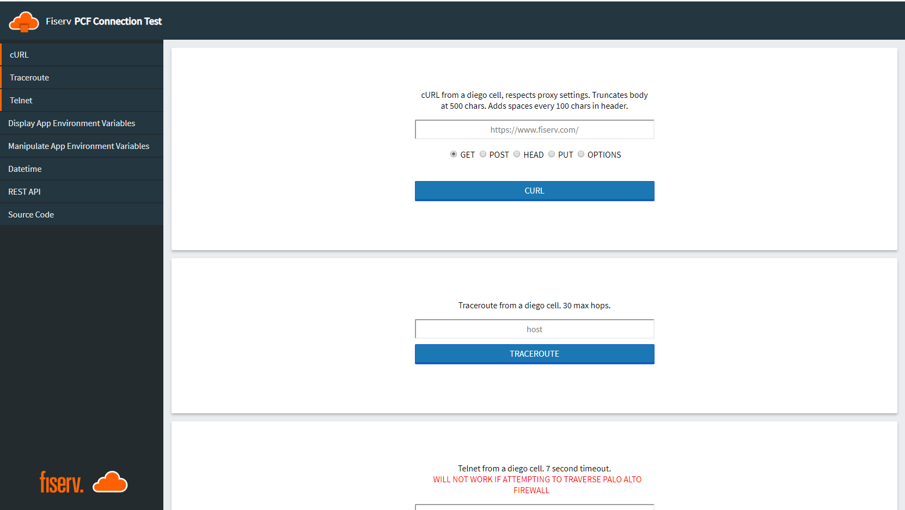

# canitconnect

Network tools running as CloudFoundry apps.
- Traceroute relys on the linux subsystem
- Telnet is implemented in pure python
- Wget is implemented with urllib2
- Grab system time
- REST API for our CLI happy people.... or machines.

Branding is done inside main.py
- indexComment => implement your own html comment <!-- your ascii art -->
- footerImg => base64 encoded image. Mine looks alright at 192 x 52 px
- headerImg => base64 encoded image. Mine looks alright at 60 x 60 px
- enterprise => The name of your corp, enterprise, or puppy

